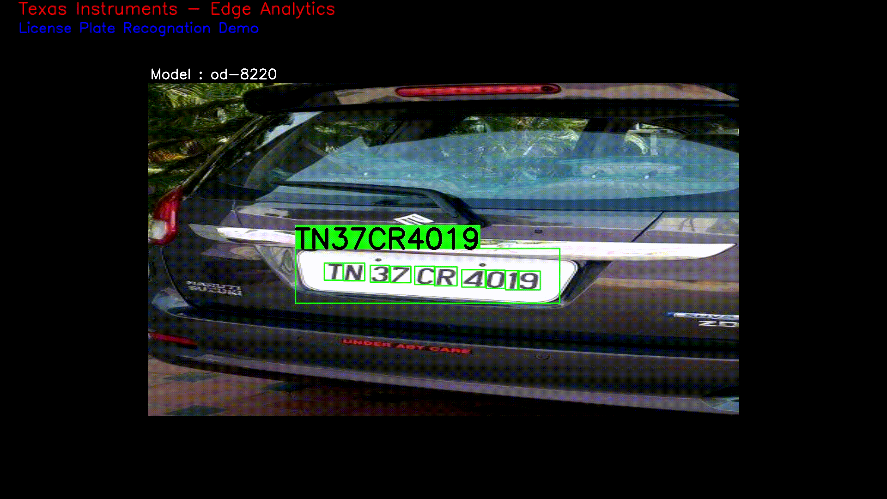

# Edge AI GStreamer Apps for License Plate Recognition
> Repository to host GStreamer based Edge AI applications for TI devices

This repo adds support for object License Plate Recognition on top of edgeai-gst-apps

## Table of content
- [Supported Devices](#supported-devices)
- [SDK Version](#sdk-version)
- [Steps to run](#steps-to-run)
- [Result](#result)
- [License Plate Recognition](#About-License-Plate-Recognition)
- [Model Directory](#model-directory)
- [How to add your own custom post-processing?](#how-to-add-your-own-custom-post-processing)
## Supported Devices

| **DEVICE**              | **Supported**      |
| :---:                   | :---:              |
| SK-TDA4VM               | :heavy_check_mark: |

## SDK Version

This demo is supported on **EdgeAI SDK Version 8.6**

## Steps to run

1. Clone this repo in your target under /opt

    ```console
    root@tda4vm-sk:/opt# git clone https://github.com/TexasInstruments/edgeai-gst-apps-lpr
    root@tda4vm-sk:/opt# cd edgeai-gst-apps-lpr
    ```

2. Run the python app

    ```console
    root@tda4vm-sk:/opt/edgeai-gst-apps-lpr# cd apps_python
    root@tda4vm-sk:/opt/edgeai-gst-apps-lpr/apps_python# ./app_edgeai.py ../configs/license_plate_recognition.yaml
    ```

3. Compile cpp apps

    ```console
    root@tda4vm-sk:/opt/edgeai-gst-apps-lpr# rm -rf build bin lib
    root@tda4vm-sk:/opt/edgeai-gst-apps-lpr# mkdir build
    root@tda4vm-sk:/opt/edgeai-gst-apps-lpr# cd build
    root@tda4vm-sk:/opt/edgeai-gst-apps-lpr# cmake ..
    root@tda4vm-sk:/opt/edgeai-gst-apps-lpr# make -j2
    ```

5. Run CPP app

     ```console
    root@tda4vm-sk:/opt/edgeai-gst-apps-lpr# cd apps_cpp
    root@tda4vm-sk:/opt/edgeai-gst-apps-lpr/apps_cpp# ./bin/Release/app_edgeai ../configs/license_plate_recognition.yaml
    ```

## Result    
</br>
<figure>
<p align="center">

</p>

<p align="center">
<figcaption align = "center"><b>The Above video is captured on display resolution 1920x1080</p></b></figcaption>

</figure>

## About License Plate Recognition
License plate recognition aims to recognize the license plate number characters. This demo is specifically useful in wide area of applications including automotive domain. This demo is built on yolox-s-lite model, which is part of model zoo.

In any license plate there are set of characters present in specific format. Example AB 01 CD 2345 etc. There are in all total 38 classes we have considered, which includes 26 alphabets from A to Z, followed by 10 classes for numbers from 0 to 9 and remaining class for License Plate.

### License Plate Recognition Model

* License Plate Recognition (LPR) framework which is enhancement of the popular YOLOX object detector. The network is end to end trainable and detects each object present in license plate as out of total 37 class. 

## Model Directory

The LPR model is present inside directory custom_compiled_models/yolox-s-lite-indian-dataset/od-8220. It is a directory containing the model, artifacts and other necessary information including dataset.yaml file which contains the dataset information of the model and params.yaml file which contains information like the task-type of the model, preprocess information, postprocess information etc.

```
/opt/edgeai-gst-apps/custom_compiled_models/yolox-s-lite-indian-dataset/od-8220
└───params.yaml
└───dataset.yaml 
└───artifacts
    └───allowedNode.txt
    └───detections_tidl_io_1.bin
    └───detections_tidl_net.bin
    └───onnxrtMetaData.txt
└───model
    └───model.onnx
    └───model.prototxt
```

## How to add your own custom post-processing?

The parent repo of this fork i.e. edgeai-gst-apps supports post-processing for image classification, object detection and semantic segmentation. Since we are adding a new type of task, we need to write out own post-processing logic for it. The application has both python and C++ variants so the same post-processing logic needs to be added to both. It is recommended to start with python and then eventually move to C++. OpenCV, a popular computer vision library is used to draw appropriate detections on the frames.

Post-processing can be simple (ex: image classification) but in some cases the output from the model cannot be directly translated to a visual format. Some complex processing might be needed to convert the output from the deep learning network to a format that can be visualized. A detailed explanation about the post processing code can be found below.

The code changes done to add post-processing logic for LPR can be found in this [commit](https://github.com/TexasInstruments/edgeai-gst-apps/commit/5861c453f777650b16bd8e9cba2894ba479b4d77).

### <ins>Basic summary of the code changes</ins>
* **apps_python**: Adding new post process class for object License Plate Recognition in post_process.py
* **apps_cpp**:    Make a new post process class for License Plate Recognitio and modify post_process_image.cpp to call the newly created class appropriately
* **configs**:     Create a new config file, add relevant changes (refer /opt/edgeai-gst-apps-lpr/configs/license_plate_recongnition.yaml)

### Post Processing Logic Python Based Flow

```
class PostProcess:

    def __init__(self, flow):
        self.flow = flow
        self.model = flow.model
        self.debug = None
        self.debug_str = ""
        if flow.debug_config and flow.debug_config.post_proc:
            self.debug = debug.Debug(flow.debug_config, "post")

    def get(flow):
        """
        Create a object of a subclass based on the task type
        """
        if flow.model.task_type == "classification":
            return PostProcessClassification(flow)
        elif flow.model.task_type == "detection":
            return PostProcessDetection(flow)
        elif flow.model.task_type == "segmentation":
            return PostProcessSegmentation(flow)
        elif (flow.model.task_type == 'licence_plate_recognition'):
            return PostProcessLPR(flow)
```

Add your custom post processing class along with other supported post processing types in post_process.py as mentioned above.

```
class PostProcessLPR(PostProcess):
    def __init__(self, flow):
        super().__init__(flow)

    def __call__(self, img, results):
        """
        Post process function for License Plate Recognition
        Args:
            img: Input frame
            results: output of inference
        """
        for i, r in enumerate(results):
            r = np.squeeze(r)
            if r.ndim == 1:
                r = np.expand_dims(r, 1)
            results[i] = r

        if self.model.shuffle_indices:
            results_reordered = []
            for i in self.model.shuffle_indices:
                results_reordered.append(results[i])
            results = results_reordered

        if results[-1].ndim < 2:
            results = results[:-1]

        bbox = np.concatenate(results, axis=-1)

        if self.model.formatter:
            if self.model.ignore_index == None:
                bbox_copy = copy.deepcopy(bbox)
            else:
                bbox_copy = copy.deepcopy(np.delete(bbox, self.model.ignore_index, 1))
            bbox[..., self.model.formatter["dst_indices"]] = bbox_copy[
                ..., self.model.formatter["src_indices"]
            ]

        if not self.model.normalized_detections:
            bbox[..., (0, 2)] /= self.model.resize[0]
            bbox[..., (1, 3)] /= self.model.resize[1]

        lp_list = self.get_lp_list(bbox, img)

        lp_highest_conf = 0
        lp_coordinates_highest_conf = 0
        for b in bbox:
            if b[5] > self.model.viz_threshold:
                if self.model.label_offset == 0:
                    class_name = self.model.classnames[int(b[4])]
                else:
                    class_name = self.model.classnames[self.model.label_offset[int(b[4])]]
                img, lp_coordinates, lp_conf = self.overlay_bounding_box_lpr(img, b, class_name)
                if lp_coordinates:
                    if lp_conf > lp_highest_conf:
                        lp_coordinates_highest_conf = lp_coordinates
                        lp_highest_conf = lp_conf

        if lp_list and lp_coordinates_highest_conf:
            img = self.overlay_lp(img, lp_list, lp_coordinates_highest_conf)

        if self.debug:
            self.debug.log(self.debug_str)
            self.debug_str = ""

        return img
```

Implement Custom Post Processing class body inside post_process.py file. Example, For License Plate Recognition we have implemented class as mentioned above.

### Post Processing Logic CPP Based Flow

```
    class PostprocessImageObjDetectLPR : public PostprocessImage
    {
        public:
            /** Constructor.
             *
             * @param config Configuration information not present in YAML
             * @param debugConfig Debug Configuration for passing to post process class
             */
            PostprocessImageObjDetectLPR(const PostprocessImageConfig  &config,
                                      const DebugDumpConfig         &debugConfig);

            /** Function operator
             *
             * This is the heart of the class. The application uses this
             * interface to execute the functionality provided by this class.
             *
             * @param frameData Input data frame on which results are overlaid
             * @param results Detection output results from the inference
             */
            void *operator()(void              *frameData,
                             VecDlTensorPtr    &results);
            
            std::vector<std::string> get_lp_list (VecDlTensorPtr &results);

            /** Destructor. */
            ~PostprocessImageObjDetectLPR();

        private:
            /** Multiplicative factor to be applied to X co-ordinates. */
            float                   m_scaleX{1.0f};

            /** Multiplicative factor to be applied to Y co-ordinates. */
            float                   m_scaleY{1.0f};

        private:
            /**
             * Assignment operator.
             *
             * Assignment is not required and allowed and hence prevent
             * the compiler from generating a default assignment operator.
             */
            PostprocessImageObjDetectLPR &
                operator=(const PostprocessImageObjDetectLPR& rhs) = delete;
    };
```

Define new custom post processing class definition inside /opt/edgeai-gst-apps-lpr/apps_cpp/common/include/, Refer above mentioned example for reference. Here we have added class definition at edgeai-gst-apps-lpr/apps_cpp/common/include/post_process_image_object_detect_lpr.h

Create new cpp file inside src directory and implement custom post processing class body.
Refer edgeai-gst-apps-lpr/apps_cpp/common/src/post_process_image_object_detect_LPR.cpp for better understanding.

```
PostprocessImage* PostprocessImage::makePostprocessImageObj(const PostprocessImageConfig    &config,
                                                            const DebugDumpConfig           &debugConfig)
{
    PostprocessImage   *cntxt = nullptr;

    if (config.taskType == "classification")
    {
        cntxt = new PostprocessImageClassify(config,debugConfig);
    }
    else if (config.taskType == "detection")
    {
        cntxt = new PostprocessImageObjDetect(config,debugConfig);
    }
    else if (config.taskType == "segmentation")
    {
        cntxt = new PostprocessImageSemanticSeg(config,debugConfig);
    }
    else if(config.taskType == "licence_plate_recognition")
    {
        cntxt = new PostprocessImageObjDetectLPR(config, debugConfig);
    }
    else
    {
        LOG_ERROR("Invalid post-processing task type.\n");
    }

    return cntxt;
}

```

Based on post processing type create new object of that class inside edgeai-gst-apps-lpr/apps_cpp/common/src/ directory. Refer above example for better understanding.

```
cmake_minimum_required(VERSION 3.10.0)

project(edgeai_common)

include(${CMAKE_CURRENT_SOURCE_DIR}/../cmake/common.cmake)

set(EDGEAI_COMMON_SRCS
    src/pre_process_image.cpp
    src/post_process_image.cpp
    src/post_process_image_classify.cpp
    src/post_process_image_object_detect.cpp
    src/post_process_image_segmentation.cpp
    src/post_process_image_object_detect_LPR.cpp
    src/edgeai_inference_pipe.cpp
    src/edgeai_demo.cpp
    src/edgeai_cmd_line_parse.cpp
    src/edgeai_gst_wrapper.cpp
    src/edgeai_gst_helper.cpp
    src/edgeai_gstelementmap.cpp
    src/edgeai_demo_config.cpp
    src/edgeai_utils.cpp
    src/edgeai_debug.cpp)

build_lib(${PROJECT_NAME} EDGEAI_COMMON_SRCS STATIC)
```

Add newly added files inside cmakelist, present at edgeai-gst-apps-lpr/apps_cpp/common/CMakeLists.txt, refer above cmakefile for reference.
